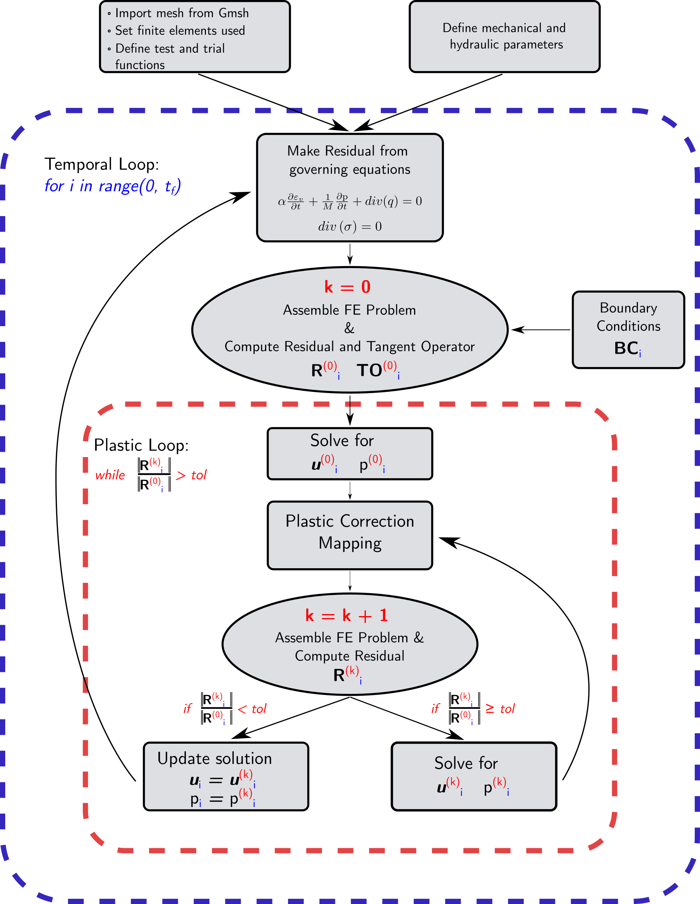

# Fluid flow migration and rock stress and deformation fields within a geothermal system due to a crustal fault: a numerical perspective

Felipe Sáez-Leiva (_[@FNSL1996](https://github.com/FNSL1996)_), Daniel E. Hurtado (_[@dehurtado](https://github.com/dehurtado)_), Muriel Gerbault (_[@murielgerbault](https://github.com/murielgerbault)_), Javiera Ruz-Ginouves (_[@JaviRG](https://github.com/JaviRG)_), Pablo Iturrieta (_[@pabloitu](https://github.com/pabloitu)_), José Cembrano.

Repository housing the codes developed for Sáez-Leiva et al., in review.

## Abstract

<figure>

<figcaption align = "center"><b> Figure 1: (a) Traditional concept for Cryer's Problem. The analytical solution for normalized fluid pressure temporal evolution at the center of the sphere p is known. (b) Setup used in our benchmark. An octant of the sphere, with free-slip and no-flow conditions on the inner surface, is used in order to improve computational performance.</b></figcaption>
</figure>